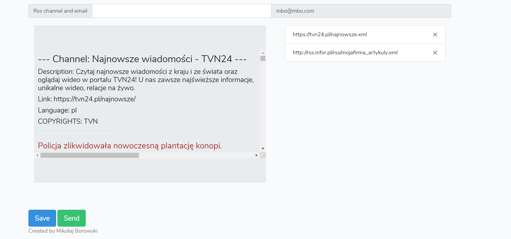

# Load test analysis
`Created by: Mikołaj Borowski`
#### APP MOCKUP:

#### API: 
  - /getChannelsList
  - /deleteChannel
  - /formSubmit
  - /channelSubmit

#### LOAD TESTS:
  - `/getChannelsList`

##### Test analysis: 
Note: 
- To create latency test i needed to use result tree for others graph was enough.
- Files: getChannelsListGraph, getChannelsListTree
- Test succeeded
> throughput: 194.367/minute |
> deviation: 7995 |
> latency: 27822 |
> sample time: 27824

  - `/deleteChannel`

##### Test analysis: 
Note: 
- To create latency test i needed to use result tree for others graph was enough.
- Files: deleteChannelGraph, deleteChannelTree
- Test had problem, not enough parameters in db to test, i dont have ids of those links. 
- For this test i needed to add body data.
- In heders CSRF-TOKEN was requaierd
- Test failed
> throughput: 28.352/minute |
> deviation: 10484 |
> latency: 3079 |
> sample time: 3079 |

  - `/formSubmit`

##### Test analysis: 
Note: 
- To create latency test i needed to use result tree for others graph was enough. |
- Files: formSubmitGraph, formSubmitTree |
- For this test i needed to add body data. |
- In heders CSRF-TOKEN was requaierd |
- For that i needed to add http headers menager |
- Body i used {'email': 'test@test.pl'} |
- Test succeeded 
> throughput: 110.323/minute
> deviation: 17135
> latency: 2721
> sample time: 2720

  - `/channelSubmit`

##### Test analysis: 
Note: 
- To create latency test i needed to use result tree for others graph was enough. |
- Files: channelSubmitGraph, channelSubmitTree |
- For this test i needed to add body data. |
- In heders CSRF-TOKEN was requaierd |
- For that i needed to add http headers menager |
- Body i used {	'chanell': 'https://tvn24.pl/najnowsze.xml'} | 
- Test succeeded 
> throughput:
> deviation: 
> latency: 138
> sample time: 136
